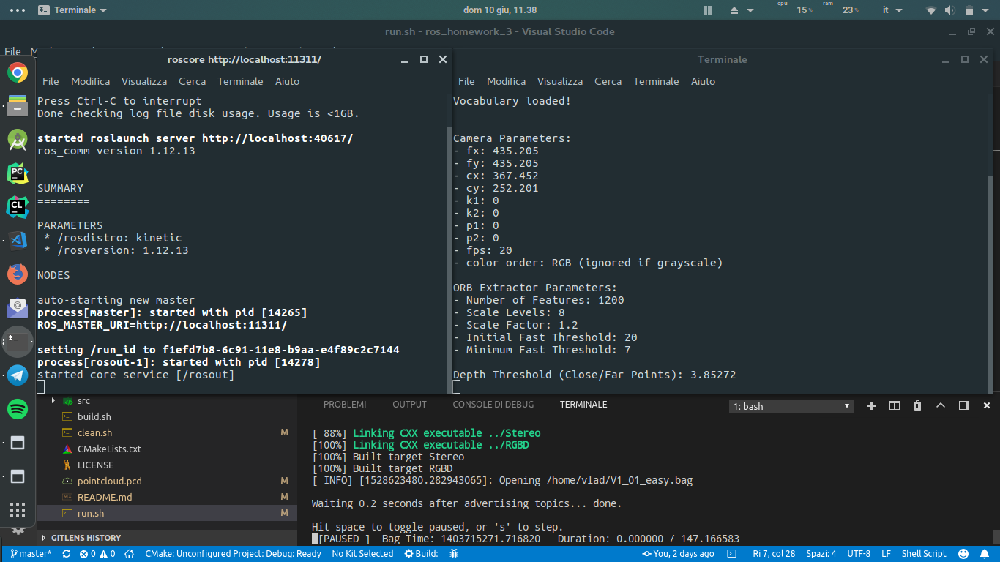
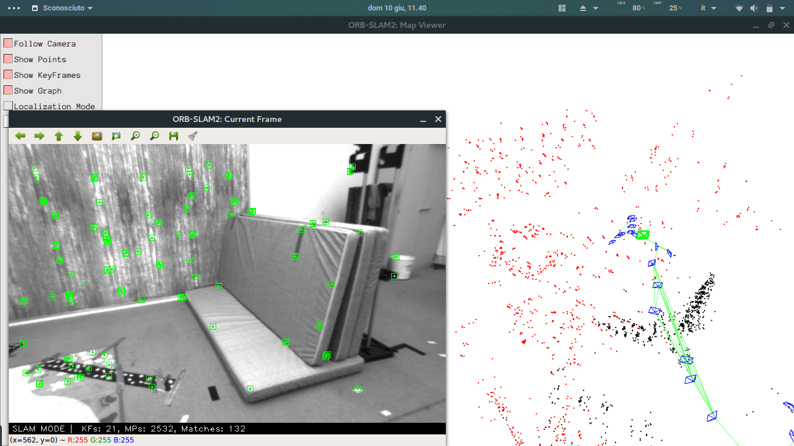
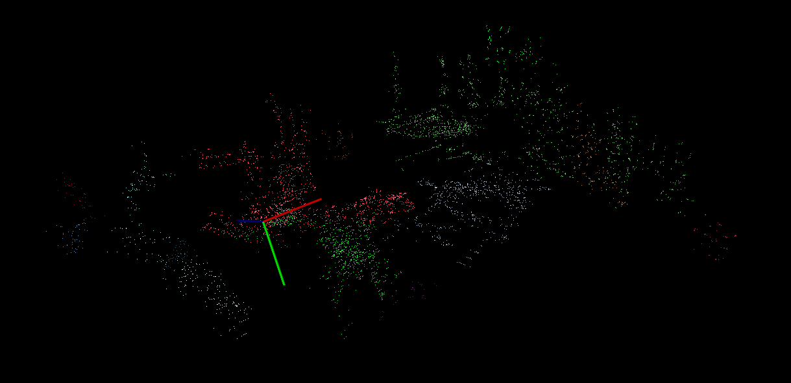

# ros_homework_3 #
##### Homework 3 [Laboratorio Ciberfisico] - University of Verona #####

### Descrizione
L'homework 3 è composto da 4 parti:
* Parte 1: installazione di ORB_SLAM2
* Parte 2: esecuzione di ORB_SLAM2 su una rosbag registrata con un drone volante
* Parte 3: creazione di una point-cloud 
* Parte 4: clustering dei punti contenuti nella point-cloud generata al punto 3

### Istruzioni per l'installazione
Le parti 1, 2 e 3 sono tutte inglobate in questo repository, tuttavia occorre aver installato la libreria esterna `Pangolin` (si vedano le [istruzioni di 
ORB_SLAM2](ORB_SLAM2/README.md) per maggiori informazioni).

```sh
$ git clone https://github.com/vladbragoi/ros_homework_3.git
```
Posizionarsi nella directory ros_homework_3 e lanciare lo script "build_all.sh" con il comando:
```sh
$ ./build_all.sh
```
il quale provvederà a compilare tutti i pacchetti necessari.
Successivamente lanciare lo script `run.sh`
```sh
$ ./run.sh
```
#### Nota:
Se necessario, modificare i path all'interno di run.sh per avviare in maniera corretta i vari script.

### Preview
Una volta che le finestre Map Viewer e Current Frame saranno visibili, lanciare l'esecuzione della bag inserendo uno spazio (premere la space-bar) nel terminale in cui è stata lanciata (terminale in basso a destra nella figura).

Successivamente occorre attendere che la bag venga eseguita fino alla fine, dopodiché usare la combinazione di tasti `Ctrl+C` per chiudere lo script orb_slam (terminale a destra nella figura) e permettere al software di salvare la mappa creata.


Infine, per visualizzare la point-cloud, posizionandovi nella directory `ros_homework_3`, lanciare il seguente comando:
```sh
$ ./bin/Cluster pointcloud.pcd
```
Oppure
```sh
$ pcl_viewer pointcloud.pcd
```
per visualizzare la mappa senza clustering.




### References ###

* [Course page (prof. Bloisi - Univr)](profs.scienze.univr.it/~bloisi/corsi/ciberfisico.html)

* [Lezione 13: Point Cloud Library](http://profs.scienze.univr.it/~bloisi/corsi/ciberfisico.html#diario)

* [ROS: PCL](http://wiki.ros.org/pcl_ros)

* [ORB_SLAM2](https://github.com/raulmur/ORB_SLAM2)


### Author ###

* `Vladislav Bragoi`, University of Verona (Italy) [vladislav.bragoi@studenti.univr.it](mailto:vladislav.bragoi@studenti.univr.it)

### License ###

> MIT License
>
> Copyright (c) 2018 Vladislav Bragoi
> 
> Permission is hereby granted, free of charge, to any person obtaining a copy
> of this software and associated documentation files (the "Software"), to deal
> in the Software without restriction, including without limitation the rights
> to use, copy, modify, merge, publish, distribute, sublicense, and/or sell
> copies of the Software, and to permit persons to whom the Software is
> furnished to do so, subject to the following conditions:
> 
> The above copyright notice and this permission notice shall be included in all
> copies or substantial portions of the Software.
> 
> THE SOFTWARE IS PROVIDED "AS IS", WITHOUT WARRANTY OF ANY KIND, EXPRESS OR
> IMPLIED, INCLUDING BUT NOT LIMITED TO THE WARRANTIES OF MERCHANTABILITY,
> FITNESS FOR A PARTICULAR PURPOSE AND NONINFRINGEMENT. IN NO EVENT SHALL THE
> AUTHORS OR COPYRIGHT HOLDERS BE LIABLE FOR ANY CLAIM, DAMAGES OR OTHER
> LIABILITY, WHETHER IN AN ACTION OF CONTRACT, TORT OR OTHERWISE, ARISING FROM,
> OUT OF OR IN CONNECTION WITH THE SOFTWARE OR THE USE OR OTHER DEALINGS IN THE
> SOFTWARE.
 